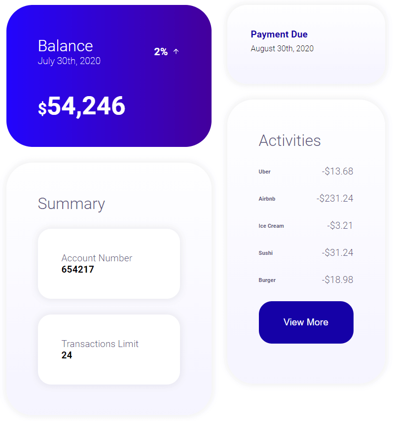

# design-demo

This project was converted from a Photoshop design file into a React app. It utilizes SCSS for the styling, webpack and Babel for bundling, transpiling, and minifying code, and React as the front-end library for creating the components. The design was borrowed from Hossein Boroji.

